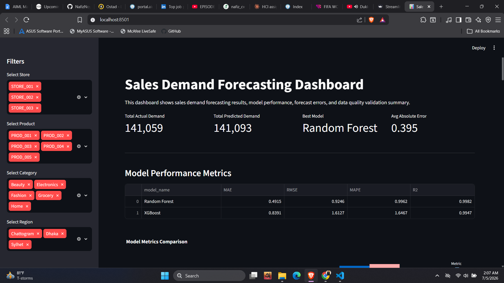
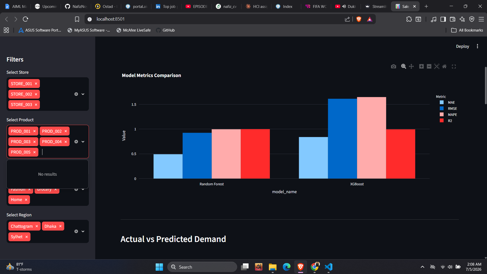
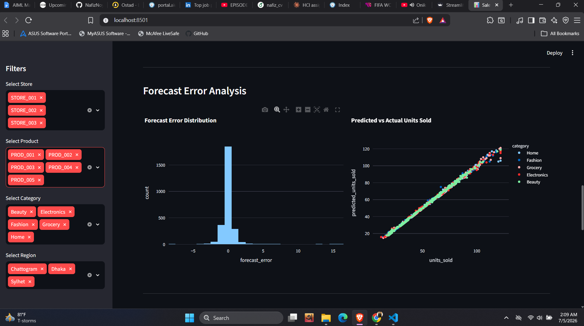

# Sales Demand Forecasting System with Automated ETL and Data Quality Checks

## Project Overview

This project is an end-to-end sales demand forecasting system built to demonstrate practical skills in data engineering, data quality validation, machine learning, API deployment, and dashboard development.

The system generates raw historical sales data, performs ETL processing, handles missing values and duplicate records, validates data quality, creates forecasting features, trains machine learning models, evaluates model performance, deploys the trained model using FastAPI, and visualizes results through a Streamlit dashboard.

This project is designed as a portfolio project to show hands-on experience with real-world data workflow concepts used in analytics, data engineering, and machine learning projects.

> **Note:** Before running the API or dashboard, run the full pipeline once using `python run_pipeline.py`. This will generate the required processed data, trained model, reports, and prediction outputs.

---

## Business Problem

Retail businesses need accurate demand forecasting to improve inventory planning, reduce stockouts, avoid overstocking, and make better operational decisions.

This project forecasts product-level sales demand using historical sales data and provides a dashboard for analyzing actual demand, predicted demand, model performance, and forecast errors.

---

## Key Features

- Raw sales data ingestion
- Automated ETL workflow
- Missing value detection and handling
- Duplicate row detection and removal
- Outlier handling using IQR method
- Data quality validation
- Data quality report generation
- Feature engineering for forecasting
- Lag and rolling window feature creation
- Random Forest and XGBoost model training
- Model evaluation using MAE, RMSE, MAPE, and R2
- FastAPI model deployment
- Streamlit interactive dashboard
- Airflow DAG structure for workflow orchestration
- One-command local pipeline runner

---

## Tech Stack

| Area | Tools and Technologies |
|---|---|
| Programming | Python |
| Data Processing | Pandas, NumPy |
| Machine Learning | scikit-learn, XGBoost |
| Model Evaluation | MAE, RMSE, MAPE, R2 |
| API Deployment | FastAPI, Uvicorn |
| Dashboard | Streamlit, Plotly |
| Visualization | Plotly, Matplotlib |
| Workflow Design | Airflow DAG |
| Model Saving | Joblib |
| Version Control | Git, GitHub |

---

## Project Architecture

```text
Raw Sales Data
      |
      v
Data Ingestion
      |
      v
Data Cleaning
      |
      v
Data Quality Validation
      |
      v
Feature Engineering
      |
      v
Model Training
      |
      v
Model Evaluation
      |
      v
Forecast Outputs, Reports, and Saved Model
      |
      v
FastAPI Model API + Streamlit Dashboard
```

---

## Repository Structure

```text
sales-demand-forecasting-etl-ml/
│
├── api/
│   └── api.py
│
├── dags/
│   └── etl_dag.py
│
├── dashboard/
│   └── forecast_dashboard.py
│
├── data/
│   ├── raw/
│   ├── processed/
│   └── forecast_output/
│
├── models/
│
├── notebooks/
│
├── reports/
│
├── screenshots/
│   ├── dashboard_overview.png
│   ├── model_metrics.png
│   └── forecast_charts.png
│
├── src/
│   ├── data_ingestion.py
│   ├── data_cleaning.py
│   ├── data_validation.py
│   ├── feature_engineering.py
│   ├── forecast_model.py
│   ├── model_evaluation.py
│   └── utils.py
│
├── run_pipeline.py
├── requirements.txt
├── .gitignore
└── README.md
```

> Generated datasets, trained model files, and reports are created after running the pipeline. Some generated files may be excluded from GitHub using `.gitignore`.

---

## Dataset

The project uses a generated demo sales dataset that simulates daily retail sales records across stores, products, categories, and regions.

Main columns include:

- order_date
- store_id
- product_id
- category
- region
- units_sold
- unit_price
- discount
- marketing_spend
- holiday
- revenue

The raw dataset intentionally includes missing values, duplicate rows, and outliers so that data cleaning and data quality validation steps can be demonstrated.

---

## ETL and Data Cleaning

The ETL workflow performs the following tasks:

- Loads raw sales data
- Removes duplicate records
- Converts date columns into proper datetime format
- Handles missing category values
- Handles missing numeric values
- Caps outliers using the IQR method
- Recalculates revenue after cleaning
- Saves the cleaned dataset for model development

Cleaned data output:

```text
data/processed/cleaned_sales_data.csv
```

---

## Data Quality Validation

The project validates the cleaned dataset before model training.

Validation checks include:

- Required columns check
- Missing values check
- Duplicate rows check
- Order date validity check
- Units sold range check
- Unit price range check
- Discount range check
- Marketing spend range check
- Holiday binary check
- Revenue range check

Generated validation outputs:

```text
reports/data_quality_report.html
reports/data_quality_summary.csv
```

---

## Feature Engineering

The forecasting dataset includes date-based, lag-based, rolling, and business-related features.

Feature examples:

- year
- month
- day
- day_of_week
- week_of_year
- quarter
- is_weekend
- is_month_start
- is_month_end
- units_sold_lag_1
- units_sold_lag_7
- units_sold_lag_14
- units_sold_lag_28
- rolling mean features
- rolling standard deviation features
- price_after_discount
- marketing_spend_per_unit

Feature dataset output:

```text
data/processed/feature_sales_data.csv
```

---

## Machine Learning Models

Two regression models were trained and compared:

- Random Forest Regressor
- XGBoost Regressor

The target variable is:

```text
units_sold
```

A time-based train-test split was used to reduce data leakage and better simulate real forecasting conditions.

---

## Model Performance

| Model | MAE | RMSE | MAPE | R2 |
|---|---:|---:|---:|---:|
| Random Forest | 0.4915 | 0.9246 | 0.9962 | 0.9982 |
| XGBoost | 0.8391 | 1.6127 | 1.6467 | 0.9947 |

Best selected model:

```text
Random Forest
```

The trained model is saved as:

```text
models/demand_forecasting_model.pkl
```

---

## Project Screenshots

### Dashboard Overview



### Model Metrics



### Forecast Charts



---

## How to Run the Project

### 1. Create Virtual Environment

```bash
python -m venv venv
```

### 2. Activate Virtual Environment

For Windows:

```bash
venv\Scripts\activate
```

### 3. Install Dependencies

```bash
pip install -r requirements.txt
```

### 4. Run the Full Pipeline

```bash
python run_pipeline.py
```

This command runs the complete workflow:

```text
Data Ingestion
Data Cleaning
Data Quality Validation
Feature Engineering
Forecast Model Training
Model Evaluation Report
```

---

## Run FastAPI

Start the API server:

```bash
uvicorn api.api:app --reload
```

Open API home:

```text
http://127.0.0.1:8000
```

Open API documentation:

```text
http://127.0.0.1:8000/docs
```

Main endpoints:

- `/`
- `/health`
- `/sample-predict`
- `/predict`

---

## Run Streamlit Dashboard

Start the dashboard:

```bash
streamlit run dashboard/forecast_dashboard.py
```

Open dashboard:

```text
http://localhost:8501
```

---

## Generated Outputs

After running the full pipeline, the project generates:

```text
data/raw/sales_data.csv
data/processed/cleaned_sales_data.csv
data/processed/feature_sales_data.csv
data/forecast_output/model_predictions.csv
models/demand_forecasting_model.pkl
models/feature_columns.pkl
reports/data_quality_report.html
reports/data_quality_summary.csv
reports/model_metrics.csv
reports/model_evaluation_report.html
```

---

## Airflow DAG

The project includes an Airflow DAG file:

```text
dags/etl_dag.py
```

The DAG demonstrates how the ETL and ML workflow can be orchestrated in a scheduled pipeline.

Pipeline task order:

```text
ingest_raw_sales_data
clean_raw_sales_data
validate_cleaned_sales_data
engineer_forecasting_features
train_forecasting_model
evaluate_forecasting_model
```

Note: The DAG is included for workflow orchestration design and portfolio demonstration. For local Windows development, use:

```bash
python run_pipeline.py
```

---

## Skills Demonstrated

This project demonstrates hands-on experience in:

- Data ingestion
- ETL pipeline development
- Data cleaning
- Data transformation
- Data quality validation
- Feature engineering
- Demand forecasting
- Machine learning regression
- Model evaluation
- FastAPI model deployment
- Streamlit dashboard development
- Airflow DAG workflow design
- GitHub project documentation

---

## Professional Value

This project is relevant for roles such as:

- Data Analyst
- Junior Data Engineer
- Junior Machine Learning Engineer
- BI Analyst
- Analytics Engineer
- Python Developer with Data Focus

It demonstrates the ability to build an end-to-end data product from raw data to model deployment and dashboard visualization.

---

## Author

MD Nafiz Akondo

BSc in Computer Science and Engineering  
American International University-Bangladesh